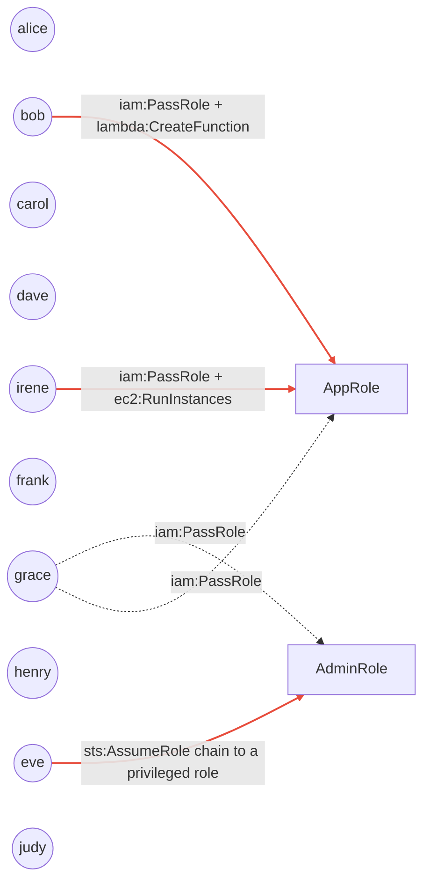

# iam-privesc-mapper

[](https://github.com/John-Axe/iam-privesc-mapper/actions/workflows/ci.yml)
[](https://github.com/John-Axe/iam-privesc-mapper/actions/workflows/codeql.yml)
[](https://scorecard.dev/viewer/?uri=github.com/John-Axe/iam-privesc-mapper)

## Problem

IAM permissions are additive, attached across users, groups, roles, and policy
versions, and the combination is rarely audited as a whole. A principal with
no obviously "admin" policy can still reach `AdministratorAccess` in one hop —
through `iam:PassRole`, a stale policy version, a permissive trust policy, or
a wildcard buried in an inline policy. `aws iam get-account-authorization-details`
dumps the raw data needed to see this, but nobody reads a multi-megabyte JSON
blob by hand. **iam-privesc-mapper** parses that dump into a graph, matches it
against a catalog of known escalation techniques, and tells you exactly which
principal can become an administrator, how, and with which permissions.

## Sample escalation path

Running the tool against the bundled fixture (`fixtures/sample_account.json`)
produces this graph. Red edges are confirmed privilege-escalation paths;
dashed edges are `PassRole` grants:



`eve` holds only `sts:AssumeRole` on `AdminRole` — a single, easy-to-miss
permission — but `AdminRole`'s trust policy allows her to assume it directly
into `AdministratorAccess`. `bob` and `irene` can each turn an unrelated
`iam:PassRole` grant into full control of `AppRole` (also admin-equivalent) by
passing it to a Lambda function or an EC2 instance they control. None of this
is visible from any single policy document; it only shows up once the graph
is assembled.

A clean, least-privilege principal (`dave`, scoped to `s3:GetObject` on one
bucket) produces zero findings — see `tests/test_detect.py`.

## Techniques covered (Rhino Security Labs set)

Defined data-driven in [`src/iam_privesc/techniques.py`](src/iam_privesc/techniques.py) —
add a new technique by appending an entry, no detector changes needed for the
common cases:

| Technique | Category |
|---|---|
| `iam:CreatePolicyVersion` | self-grant |
| `iam:SetDefaultPolicyVersion` (rollback to an over-permissive version) | rollback |
| `iam:AttachUserPolicy` / `iam:AttachRolePolicy` | self-grant |
| `iam:PutUserPolicy` / `iam:PutRolePolicy` | self-grant |
| `iam:AddUserToGroup` | self-grant |
| `iam:CreateAccessKey` on another user | self-grant |
| `iam:PassRole` + `lambda:CreateFunction` (+ `InvokeFunction`) | pass-role |
| `iam:PassRole` + `ec2:RunInstances` | pass-role |
| `sts:AssumeRole` chains to an admin-equivalent role | assume-role |
| `iam:*` / `*:*` policy wildcards | wildcard |

## Install

```bash
pip install -e ".[dev]"
```

## Run offline (default — safe, no AWS credentials)

```bash
iam-privesc --out-dir out
```

Reads the bundled fixture and writes `out/findings.json`, `out/findings.md`,
`out/graph.mmd`, and `out/graph.png`.

Use a different fixture/export:

```bash
iam-privesc --input path/to/authorization_details.json --out-dir out
```

## Run live (read-only AWS calls)

```bash
pip install -e ".[live]"
iam-privesc --from-account --profile my-profile --region us-east-1 --out-dir out
```

This calls exactly one read-only IAM API — `GetAccountAuthorizationDetails`
(paginated) — and nothing else. No credentials are required, or used, for the
offline path.

## Impact

In the bundled 10-user sample account, 9 users (90%) have at least one
undocumented path to `AdministratorAccess` that isn't visible from any single
attached policy.

## Tests

```bash
pytest -v
```

## Security

This repo practices what it preaches:

- **CodeQL** ([`codeql.yml`](.github/workflows/codeql.yml)) — static analysis on every push, PR, and weekly, results in the Security tab.
- **OpenSSF Scorecard** ([`scorecard.yml`](.github/workflows/scorecard.yml)) — supply-chain posture checked on push to `main` and weekly, SARIF uploaded to the Security tab, badge above.
- **Dependabot** ([`dependabot.yml`](.github/dependabot.yml)) — weekly update PRs for both the `pip` dependencies and the `github-actions` workflow dependencies.
- **gitleaks** ([`gitleaks.yml`](.github/workflows/gitleaks.yml)) — independent secret-scanning pass on every push/PR.
- **Pinned, least-privilege workflows** — every third-party Action is pinned to a full commit SHA (not a floating tag), each workflow declares an explicit `permissions:` block defaulting to `contents: read`, and superseded runs are cancelled via `concurrency:`.

## License

MIT — see [LICENSE](LICENSE).
